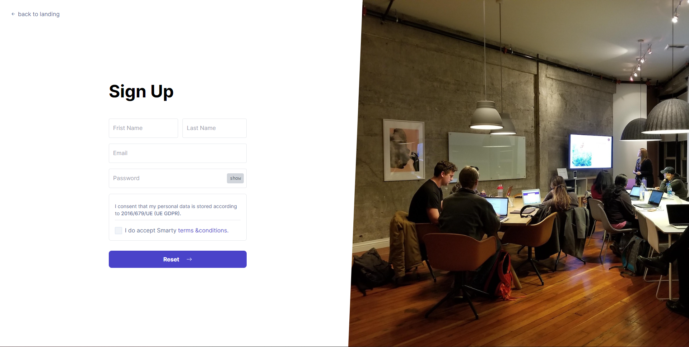
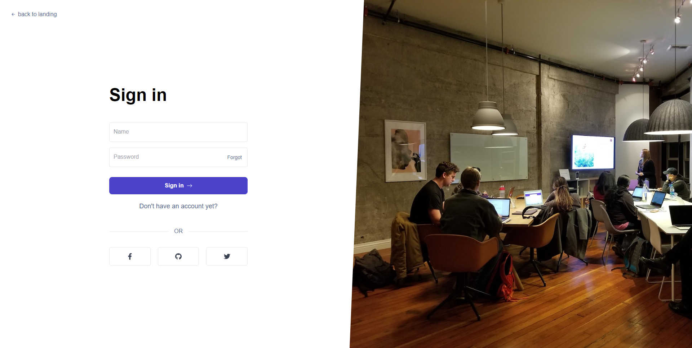
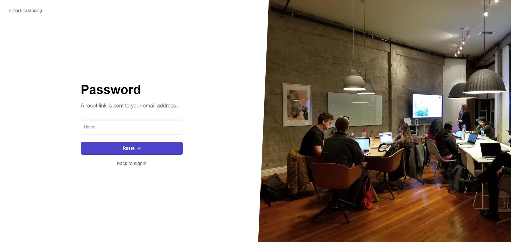

# Smarty Tailwind

# [Home](https://zubairbhuian.github.io/smarty_tailwind/)
<a href="https://zubairbhuian.github.io/smarty_tailwind/">

    

<a/>

# [Sign-up](https://zubairbhuian.github.io/smarty_tailwind/sign_up.html)
<a href="https://zubairbhuian.github.io/smarty_tailwind/sign_up.html">

    

<a/>

# [Sign-in](https://zubairbhuian.github.io/smarty_tailwind/sign_in.html)
<a href="https://zubairbhuian.github.io/smarty_tailwind/sign_in.html">

    

<a/>

# [Forgot](https://zubairbhuian.github.io/smarty_tailwind/forgot.html)
<a href="https://zubairbhuian.github.io/smarty_tailwind/forgot.html">

    

<a/>